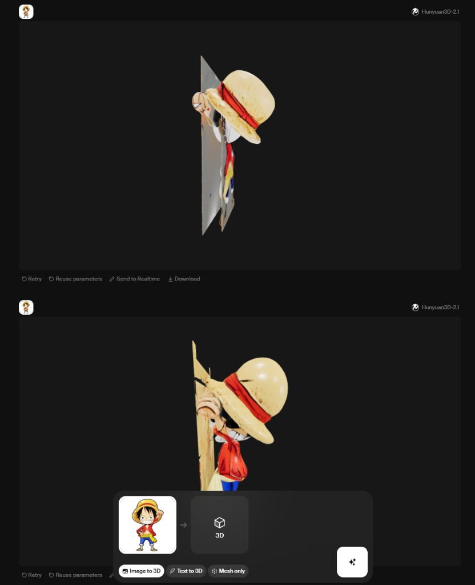
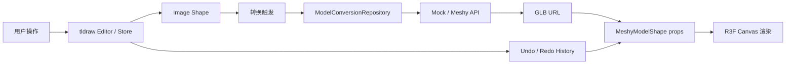

# Meshy 作业实现（tldraw + R3F）

## 1. 项目概述

本项目实现了一个 `3D in 2D Canvas` 原型：用户在 `tldraw` 无限画布中上传图片，并将其转换为可交互的 3D 模型 shape。

核心目标：

- 图片 -> 3D 的可操作闭环
- 2D 画布语义与 3D 模型渲染并存
- 关键操作可被 undo/redo 正确回放

## 2. 技术栈

- React + TypeScript
- tldraw（画布、shape、历史系统）
- React Three Fiber + drei（GLB 渲染）
- antd（反馈提示与控件）
- Vitest + Testing Library（单元测试）

## 3. 本地运行

```bash
pnpm install
pnpm dev
```

常用命令：

```bash
pnpm lint
pnpm build
pnpm test
pnpm test:watch
pnpm test:coverage
pnpm preview
```

---

## 4. Part 1 调研笔记

### 4.1 Krea「图片转 3D」体验观察

- 流程可拆为“构网（mesh generation）”与“贴纹理（texturing）”。
- 构网阶段会展示三角网格，并有基础光影动效。
- 贴图阶段先出现前方平面，再将纹理映射回 mesh。
- 实测问题：模型立体感不足，局部纹理映射错乱（混元模型）。

示意图：



调研结论：本作业优先保证交互闭环、几何语义正确、历史一致性，不以生成质量本身作为主优化目标。

### 4.2 tldraw 自定义 shape 机制结论

- `MeshyModelShape` 通过自定义 `ShapeUtil` 承载 `assetUrl / w / h / yRotation`。
- shape props 是业务状态单一来源，避免把关键状态放到本地 React state。
- 对 props 的修改走 `editor.updateShape`，才能自然纳入 tldraw 历史。
- 2D 交互（选中/平移/缩放/删除）由 tldraw 管，3D 仅负责 shape 内可视内容。

### 4.3 R3F 嵌入方案对比与选型

| 方案 | 描述 | 性能 | 交互隔离 | 状态一致性 | 实现复杂度 | 可扩展性 | 总分 |
| --- | --- | --- | --- | --- | --- | --- | --- |
| A | 每个 shape 独立 R3F Canvas | 3 | 5 | 5 | 5 | 3 | **21** |
| B | 全局单 Canvas + 多视口 | 5 | 3 | 4 | 2 | 5 | **19** |
| C | 预渲染贴图 + 按需实时 3D | 4 | 4 | 3 | 2 | 4 | **17** |

最终选型：**A（每 shape 独立 Canvas）**。  
理由：在 4-6 小时限制下最稳、最短路径跑通 Must-have，且 history 与 shape 生命周期天然一致。

---

## 5. 功能完成情况（Must-have / Nice-to-have）

### 5.1 已完成

- 无限画布 + 图片拖拽上传
- 图片 shape hover 触发“转 3D”入口
- 转换过程覆盖层与进度反馈（含失败提示）
- 图片原位替换为 `meshy-model` shape（保留位置与尺寸）
- 3D shape 的选中 / 平移 / 等比缩放 / 删除
- shape 内 GLB 渲染（光照、透明背景、容器内裁剪）
- 选中 3D shape 的左右旋转控件（每次 45°）
- 旋转写入 `yRotation`，与 2D `rotation` 解耦
- 关键历史一致性修复（异步替换 + undo/redo）
- 单元测试 3 条（成功链路、失败链路、长任务删除源图）

### 5.2 暂未覆盖 / 仅部分覆盖

- 真实 Meshy API 长轮询的完整线上稳定性（当前以可运行链路为主）
- 5+ / 50+ shape 的性能专项优化仅有方向性方案，未做系统压测
- 协同与持久化能力未实现（题目 Stretch）

---

## 6. Part 4 总结报告（按作业要求）

### 6.1 方案选择说明

本实现坚持“2D 语义优先，3D 作为 shape 内内容层”的架构：  
tldraw 负责对象级交互与历史系统，R3F 负责模型渲染与姿态展示。  
在受限时间内，优先打通可验证的 Must-have 全链路，而不是提前过度投入全局共享 WebGL 等高复杂方案。

### 6.2 架构与数据流



### 6.3 Must-have / Nice-to-have 完成情况

- Must-have：核心链路已跑通（上传、转换、替换、2D交互、姿态旋转、基础回放）
- Nice-to-have：undo/redo 的关键捕获问题已定位并修复，补充了对应测试
- Stretch：未做（共享 Context、大规模性能、协同持久化）

### 6.4 遇到的关键问题与排查

- **问题 1：异步替换后 undo 错位**
  - 现象：撤销后出现中间空白态
  - 根因：异步替换命令边界不清，历史步被拆分或合并不当
  - 处理：替换走 store 命令链 + 显式 `markHistoryStoppingPoint`

- **问题 2：shape resize 时 3D 画布抖动且不铺满**
  - 现象：缩放中模型疯狂跳变，结束后 canvas 与容器不对齐
  - 根因：受 transform 影响的尺寸测量与相机连续重算叠加
  - 处理：R3F `resize.offsetSize` 策略 + 容器/画布尺寸同步样式收敛

- **问题 3：入口控件交互冲突（hover 点不到）**
  - 根因：hover 态切换与事件冒泡冲突
  - 处理：覆盖层显示条件与 pointer 事件隔离优化

### 6.5 如果再给一天会优先做什么

1. 多 shape 性能优化（拖拽中降质、静止后恢复、帧率策略）
2. 真实 Meshy API 全链路稳态治理（超时、重试、中断恢复）
3. 渲染质量优化（环境贴图、材质校正、模型 framing 策略细化）
4. 结果持久化与协同可扩展设计

### 6.6 时间与工具记录

总用时：**约 5 小时 10 分钟**

阶段分配（不含用餐）：

- 调研与方案选型：约 45 分钟
- 上传/转换链路与交互入口：约 70 分钟
- R3F 渲染与 shape 语义对齐：约 95 分钟
- 旋转控件、history/undo 修复：约 55 分钟
- 单测与 README 整理：约 65 分钟

AI 工具使用记录：

- Cursor Agent：快速查阅 tldraw / R3F 相关 API、生成与迭代代码
- AI 主要用于脚手架、候选实现与问题定位；最终方案取舍由人工决策

---

## 7. Undo/Redo 关键结论

- `yRotation` 必须写入 `shape.props` 并通过 tldraw store 更新。
- 异步转换完成后的 shape 替换，同样必须走 store 命令链并设置历史边界。
- 若绕开 store（仅本地 state），undo/redo 无法可靠回放，状态一致性会丢失。
